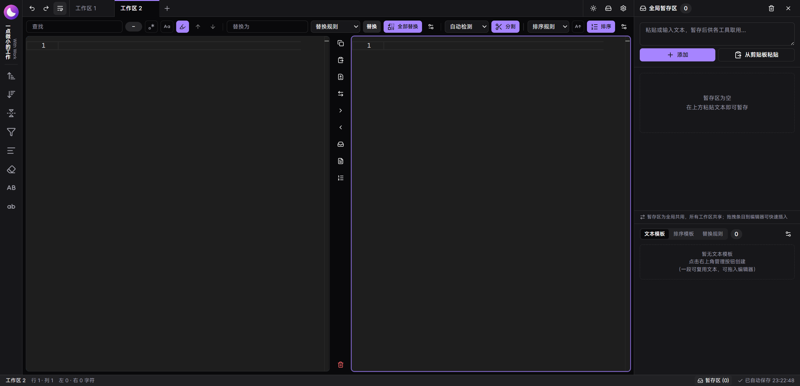

  

<h1 align="center">一点微小的工作</h1>

  
  
  

> 本项目由 AI 协作完成：代码、文档与迭代均经 AI 生成和优化。

## 功能

- **多工作区**：标签页切换，各自独立保存与撤销历史
- **双栏编辑器**：Monaco 内核，支持 VS Code 常用快捷键（Ctrl+D 多光标、Alt+↑/↓ 移动行等）
- **查找替换**：正则、计数高亮、自定义替换规则一键调用
- **分割排序**：按分隔符拆分；按自定义模板排序（支持开头匹配）
- **文本对比**：双编辑器一键 Diff 对比
- **暂存区**：文本条目、文本模板、排序模板、替换规则，可拖入编辑器复用
- **数据管理**：自动保存、全量备份、JSON 导入导出
- **双构建**：部署版（含 PWA 离线）与单文件 HTML

## 许可证

[MIT](LICENSE)
